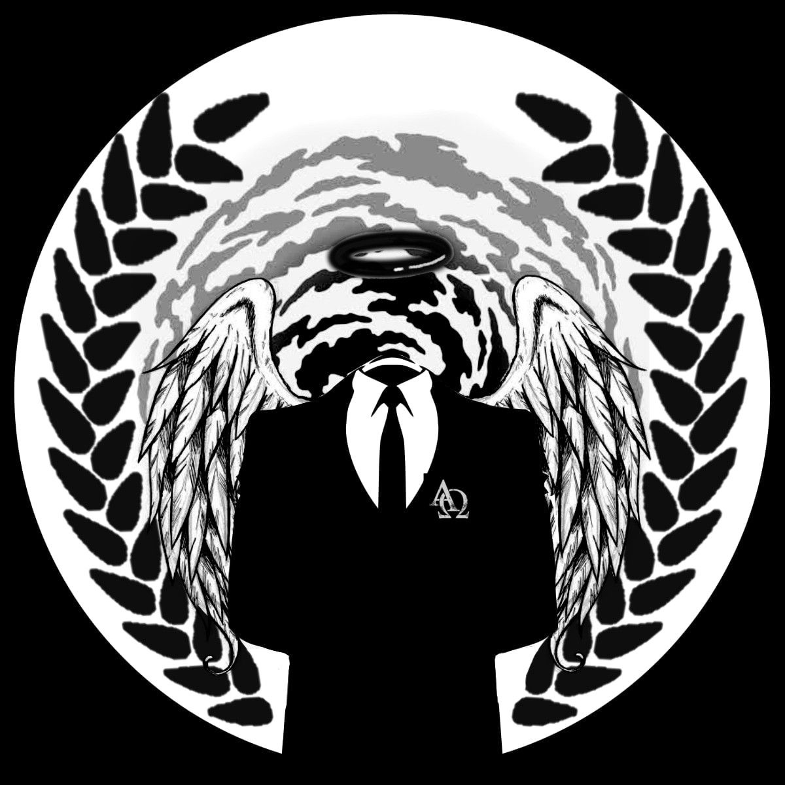
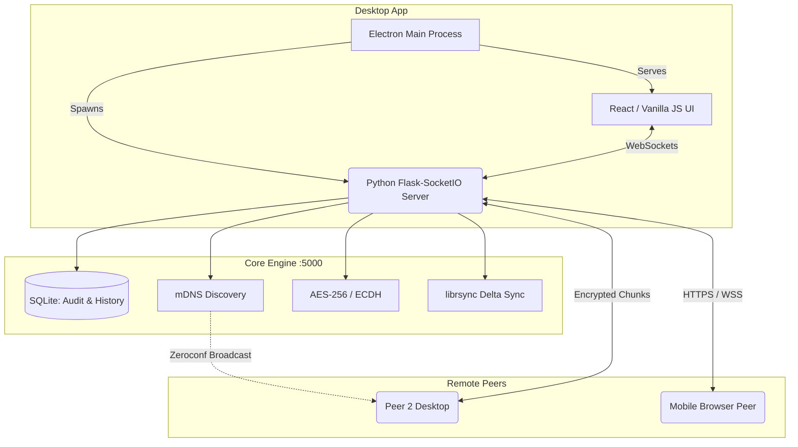

<div align="center">



#  LANxfer 2.0
**The Ultimate Offline-First, Encrypted P2P File Transfer Protocol & Dashboard**

[](https://fossunited.org/fosshack/2026)
[](LICENSE)
[](https://python.org)
[](https://electronjs.org)

*No internet. No accounts. No configuration. Just seamless transfers.*

[Demo Video](#demo) · [Features](#key-features) · [Architecture](#how-it-works) · [Installation](#installation)

</div>

---

##  The Problem

Transferring files across devices on the same local network is surprisingly broken. Cloud services like Google Drive compress files, limit sizes, and completely fail without internet. Browser-based P2P tools (WebRTC) fail silently behind corporate NAT/firewalls. Apple's AirDrop is incredible but platform-locked. Solutions like USB drives are cumbersome. 

**There is no open-source, cross-platform, offline-native tool with a premium, seamless desktop UX... until LANxfer 2.0.**

---

##  Key Features

LANxfer 2.0 brings enterprise-grade security and robust networking into a breathtaking "Tech-Noir" interface.

###  Enterprise-Grade Security & P2P
* **Zero Configuration Discovery:** Peers appear automatically via **mDNS/Zeroconf**. No manual IP entry required. Ever.
* **Per-Session ECDH Key Exchange:** Generates a fresh session key per transfer using Elliptic Curve Diffie-Hellman (SECP256R1). Zero static secrets.
* **Military-Grade Encryption:** **AES-256-GCM** authenticated encryption ensures integrity and confidentiality per chunk.
* **Device Fingerprinting:** SHA-256 trust-on-first-use model (`~/.lanxfer/trusted_devices.json`).
* **Zero Internet Required:** Works flawlessly over LAN, Wi-Fi Direct, Mobile Hotspot, or Tethering.

###  Next-Gen Transfer Engine
* **Delta Sync (librsync):** If you re-send a modified file, LANxfer 2.0 calculates the binary diff and **only transmits changed byte ranges**. Achieves up to 100x bandwidth savings!
* **Resumable Chunking:** Files are sent in SHA-256 verified 4MB chunks. If disconnected, it auto-resumes from the exact skipped offset upon reconnection.
* **Real-Time Visualizations:** Live transfer speed, delta savings charts (Chart.js), and exact chunk progression mapping.

###  Premium "Tech-Noir" UX
* **Glassmorphism UI:** Stunning grid-based dashboard, sleek dark mode, and dynamic micro-animations.
* **Command Palette:** Press `Ctrl+K` globally to open a spotlight-style command search. Trigger uploads, refresh peers, or search transfer history instantly.
* **Clipboard Sharing:** Send copied text/URLs peer-to-peer and receive it as an OS notification toast with a 1-click apply.
* **Mobile-Ready via QR:** Scan a QR code on desktop; your mobile device joins the secure swarm via a browser peer—no app installation required on the phone.

---

##  Architecture & How It Works

LANxfer 2.0 uses a hybrid architecture. The robust transfer engine, encryption, and mDNS discovery run as a Python background service (Flask + SocketIO), while the frontend is a native Electron wrapper running a stunning Vanilla JS/CSS web app.



### Delta Sync Flow
Instead of resending a 1GB file when you fix a typo:
1. Sender asks: *"Do you have `video.mp4` with hash `XYZ`?"*
2. Server matches hash and returns storage flag.
3. Server computes rolling checksums (librsync) and generates a diff signature.
4. Only the new encoded delta changes are transmitted.
5. Server reconstructs the exact file locally.

---

##  Tech Stack

| Layer | Technologies Used |
|---|---|
| **Desktop Shell** | Electron 33, electron-builder |
| **Transfer Engine** | Python 3.9+, Flask, Flask-SocketIO, Eventlet |
| **Frontend UI** | Vanilla JS, HTML5, CSS3, Chart.js (Glassmorphic Tech-Noir UI) |
| **Peer Discovery** | python-zeroconf (mDNS / Bonjour) |
| **Cryptography** | `cryptography` (AES-256-GCM + SECP256R1 ECDH), `pycryptodome` |
| **Delta Sync** | librsync (`delta.py` implementation) |
| **Database** | SQLite3 (Persistent Audit Log & Transfer State) |

---

##  Installation & Running

### ⚡ Option 1: Standalone Installer (Recommended)
Requires [Python 3.9+](https://python.org/downloads) installed on your machine.
During install, check **"Add Python to PATH"**.

You just require Python to use LANxfer. The entire Python backend, virtual environment, and UI are fully bundled into a single standalone `.exe`!

1. Go to the [**GitHub Releases**](https://github.com/Atharvasawant09/Lanxfer2.0/releases) tab.
2. Download the latest `LANxfer-Setup-2.0.0.exe`.
3. Run the installer and you're good to go!

---

### 🛠️ Option 2: Build From Source

#### Prerequisites
- Python 3.9+
- Node.js 18+ and npm 9+

#### 1. Clone the repository
```bash
git clone https://github.com/Atharvasawant09/Lanxfer2.0.git
cd Lanxfer2.0
```

#### 2. Setup Python Environment
```bash
python -m venv .venv

# Windows
.venv\Scripts\activate

# macOS / Linux
source .venv/bin/activate

pip install -r requirements.txt
```

#### 3. Setup Desktop Environment
```bash
npm install
```

#### 4. SSL Certificates (Required for HTTPS & Mobile)
Generate a self-signed cert in the root directory:
```bash
openssl req -x509 -newkey rsa:4096 -keyout key.pem -out cert.pem -days 365 -nodes -subj "/CN=localhost"
```

#### 5. Start Development Server
```bash
npm run dev
```

#### 6. Build the Executable
Package the entire Electron app and Python backend into a highly optimized installer:
```bash
npm run build:win
```
*The `.exe` will be generated inside the `dist/` folder.*

---

##  Usage

1. **Launch:** Run the app. It will start a local server and seamlessly wrap it in the Electron UI.
2. **Discover:** Any other LANxfer instance on your network will instantly pop up under "Active Peers".
3. **Transfer:** Drag & Drop a file onto the UI, select your peer. Watch the real-time chunk visualizer.
4. **Command Palette:** Test `Ctrl+K` to search files or actions.
5. **Mobile Connect:** Press "Show QR Code" (`Ctrl+K` -> QR) and scan it with your phone. Accept the SSL warning, and your phone can now securely interact with your desktop file swarm!

---

<div align="center">
  <b>Built by Atharva for FOSS Hack 2026</b><br>  Available under the <a href="LICENSE">MIT License</a>.
</div>